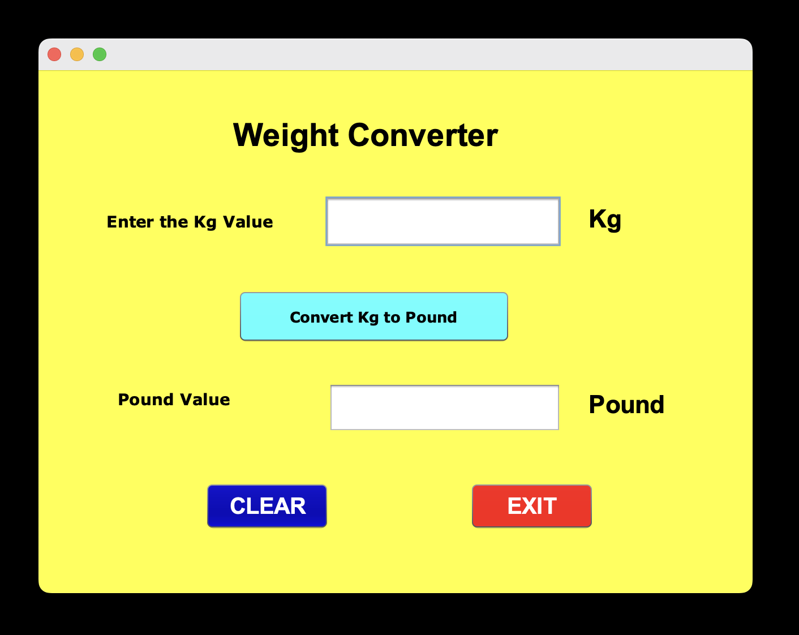
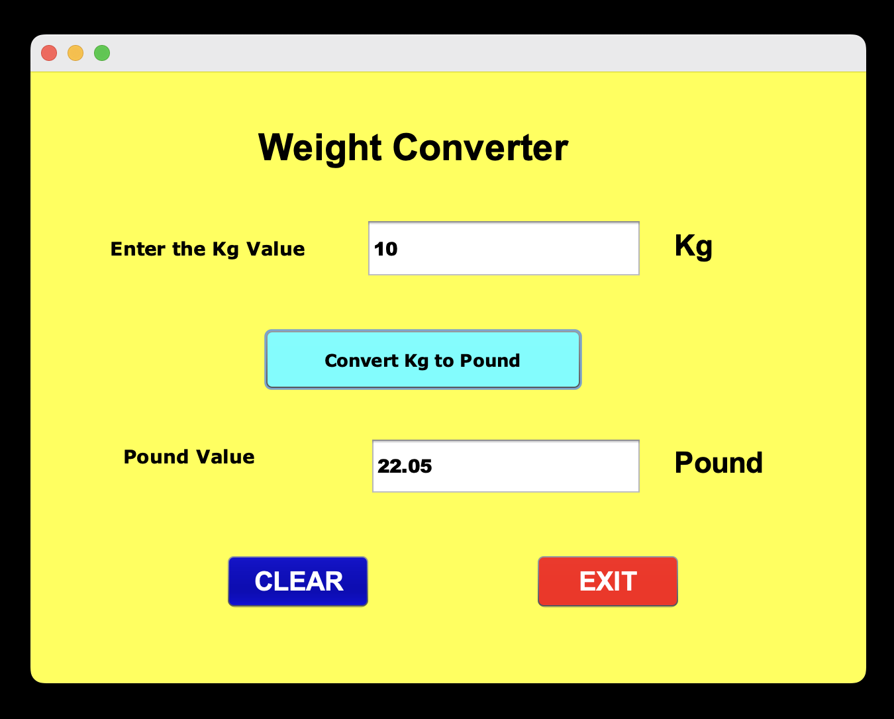

# 🏋️‍♀️ Weight Converter

A simple and intuitive **Java Swing desktop application** that converts weight from **kilograms (kg)** to **pounds (lbs)**.

## 🔧 Features

- User-friendly graphical interface using **Java Swing**
- Converts input in **kilograms** to **pounds**
- **Clear** button to reset the input and result
- **Exit** button to close the application
- Lightweight and fast

## 📐 Conversion Formula

> ✅ **1 kilogram (kg) = 2.20462 pounds (lbs)**

## 🖼️ Weight Converter GUI




## 🚀 Getting Started

### Prerequisites

- Java JDK 8 or above
- Any IDE that supports Java (Eclipse, IntelliJ, NetBeans, etc.)

### How to Run

## ✅ Option 1: Clone and Run via Source Code

1. Clone the repository:
   ```bash
   git clone https://github.com/hema-priya-vadivel/WeightConverter.git

2. Open the project in your preferred IDE.

3. Run the main class (usually WeightConverter.java).

4. Enter weight in kilograms and click Convert.

5. Use the Clear button to reset fields or Exit to close the app.

## ✅ Option 2: Download & Run Application Directly

If you don't want to clone the source code:

- [Download for Mac (.dmg)](https://github.com/hema-priya-vadivel/WeightConverter/blob/master/releases/download/WeightConverter-macOS-1.0.dmg)
